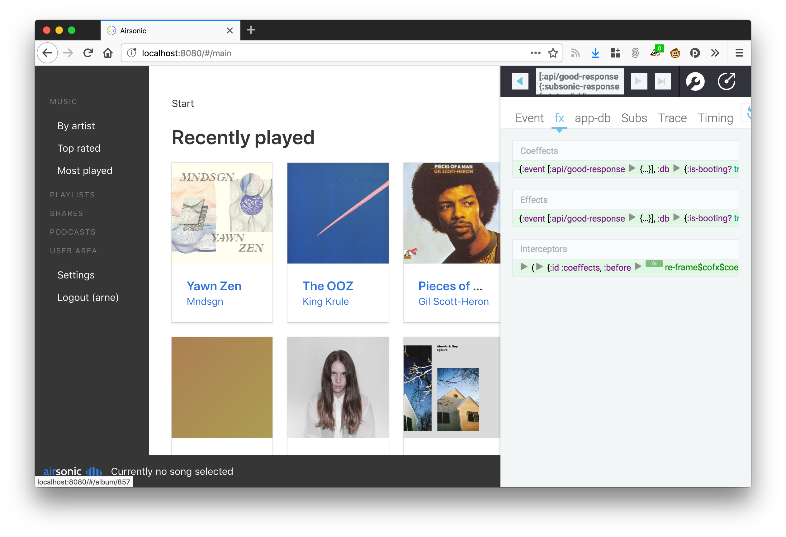

# Airsonic Web Client [](https://travis-ci.org/heyarne/airsonic-ui)

This repository contains an alternative web frontend for [airsonic](https://github.com/airsonic/airsonic). The goal is to eventually be able to fully replace the current web interface.

## Implemented so far

* Login with persisting credentials
* Browse your library by newest / most recently played / starred
* Browse artists alphabetically
* A currently playing queue with next, previous, repeat and shuffle
* Information about the current track with the ability to seek

## Development

The project is written in [ClojureScript](https://clojurescript.org/) and uses [re-frame](https://github.com/Day8/re-frame) for structure and peace of mind. The build tool is [shadow-cljs](https://shadow-cljs.github.io/docs/UsersGuide.html), which offers nice editor integration and interoparibility with the whole JavaScript ecosystem.
If you haven't worked with re-frame: I highly recommend it. Good resources are the project's [docs](https://github.com/Day8/re-frame/tree/master/docs) and a [post about its building blocks](https://purelyfunctional.tv/guide/re-frame-building-blocks/).

To build the project make sure you have Node.js (v6.0.0), npm and Java 8 installed in your system.

```
# after cloning the project, first install all dependencies
$ npm install

# start a continuous build with hot-code-reloading and continuous testing
# first build takes a while. open http://localhost:8080
$ npm run dev
```

### Editor integration

Integrating shadow-cljs with your editor helps tremendously with development. After having run `npm run dev` as described above you can connect to the REPL and get features like in-editor code execution and code completion / documentation lookup. For further information see [this part of the shadow-cljs user guide](https://shadow-cljs.github.io/docs/UsersGuide.html#_editor_integration), which contains instructions for Emacs, Atom, VSCode and other editors. Make sure to open `localhost:8080` in the browser to execute ClojureScript code.

### re-frame-10x

re-frame-10x is a debugger that is bundled with the app in development mode. Once you have the build running, hit `Ctrl + h` and the re-frame-10x window will show up:



It provides you with tools to inspect the state of the application, undo and replay events, debug performance issues and more.

## Tests

This project uses [karma](https://karma-runner.github.io/) for tests. Make sure to have Google Chrome installed, otherwise the watcher will time out. If you want to run tests continuously in the background, you may want to have Growl installed to show notifications ([see setup instructions](https://www.npmjs.com/package/karma-growl-reporter#installation)).

```
# run tests once
$ npm test
```

**Note:** If you want nice console output in your tests, make sure to `(enable-console-print!)`. You can call `println` afterwards like you're used to.

## Deployment

```
# build and optimize the code once for production
$ npm run build

# runs npm run build and publishes everything via gh-pages
$ npm run deploy
```

All build artifacts land in `/public`. Don't change anything in there as changes will be overwritten.
